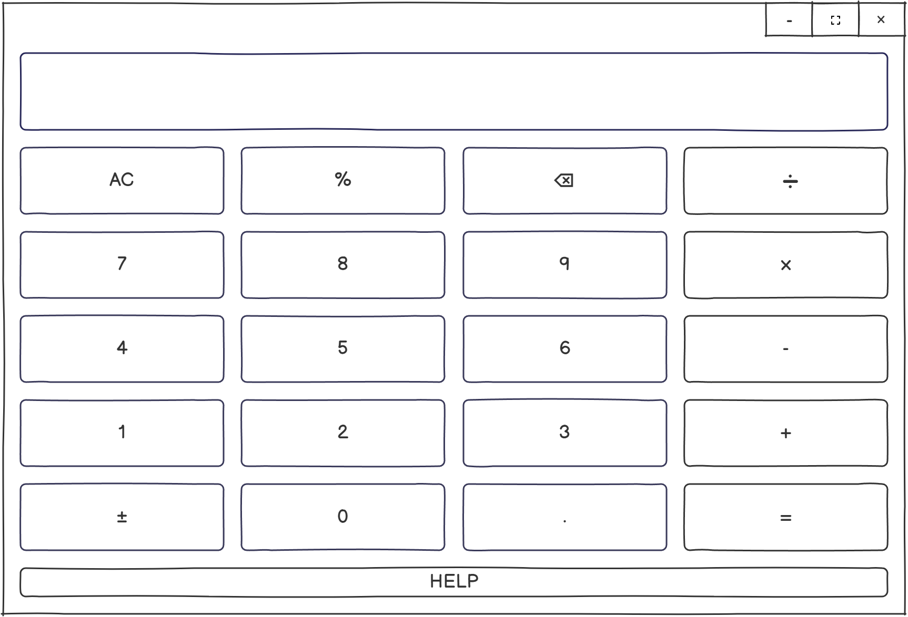
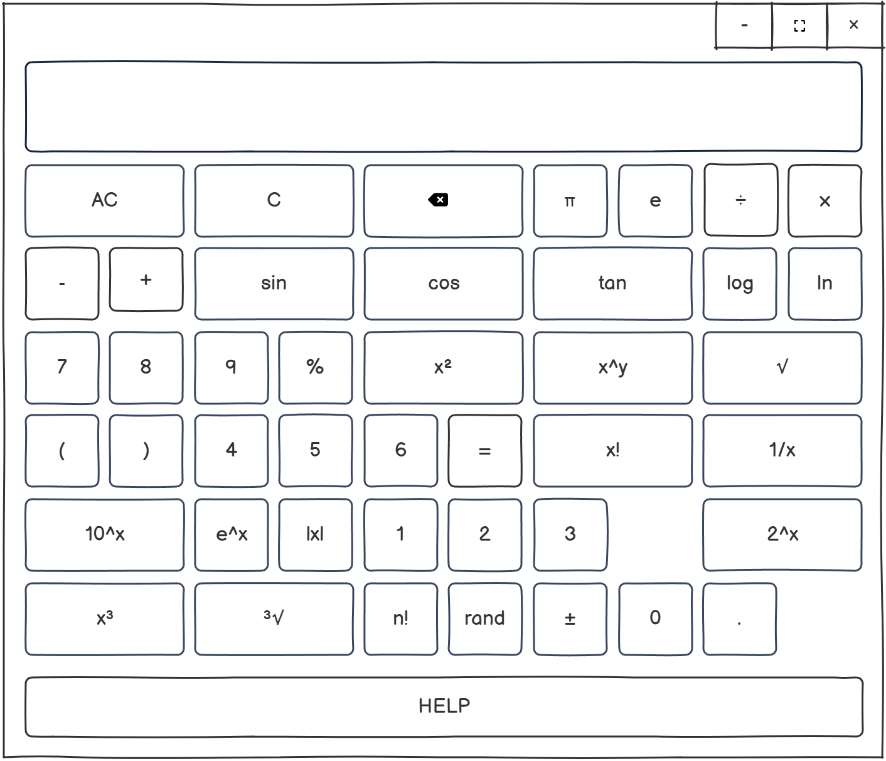
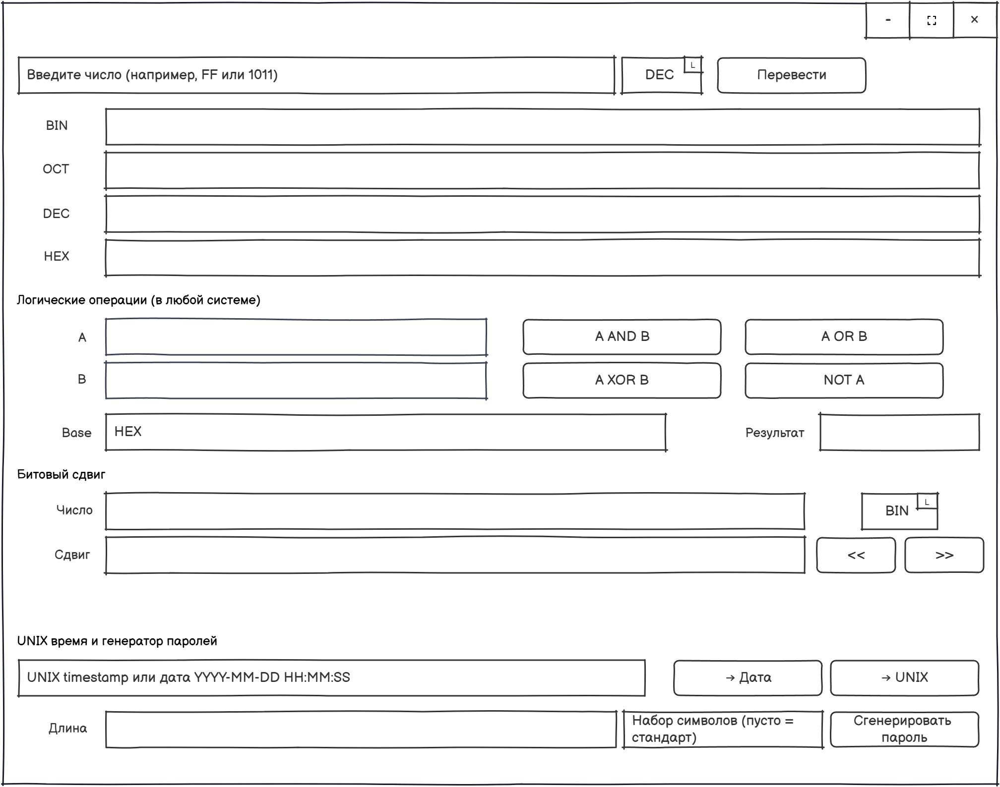
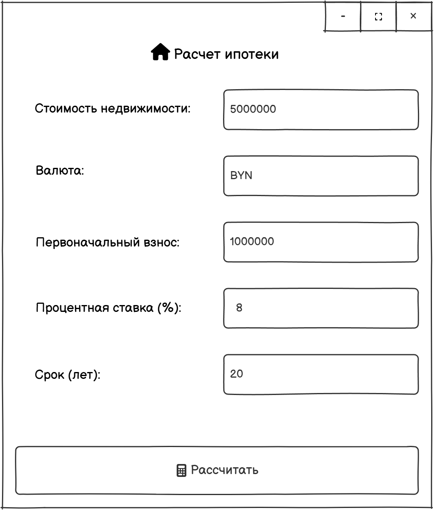
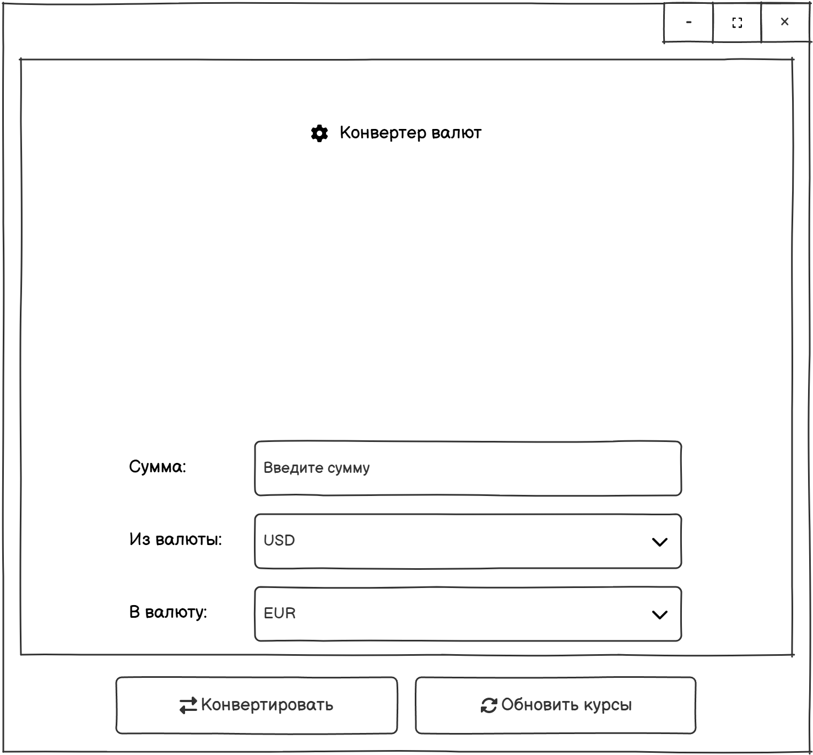
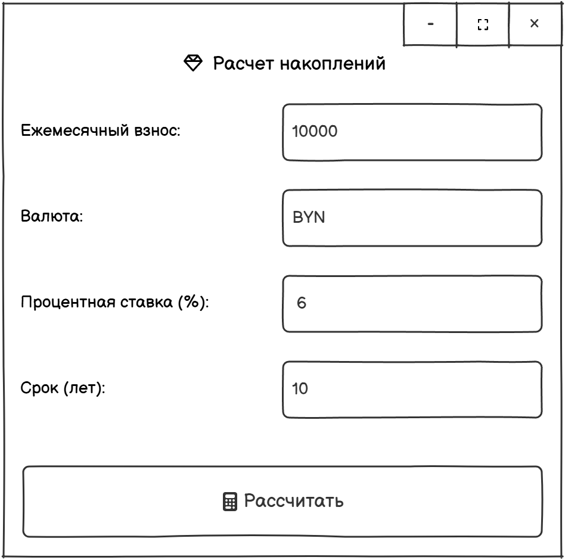
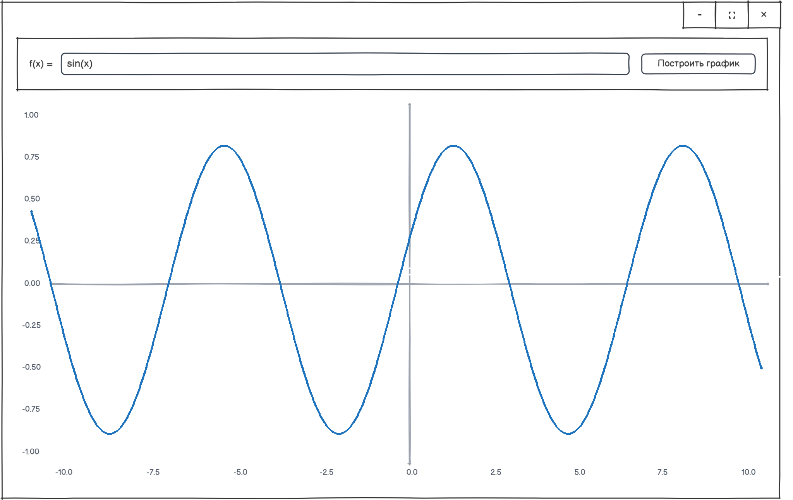
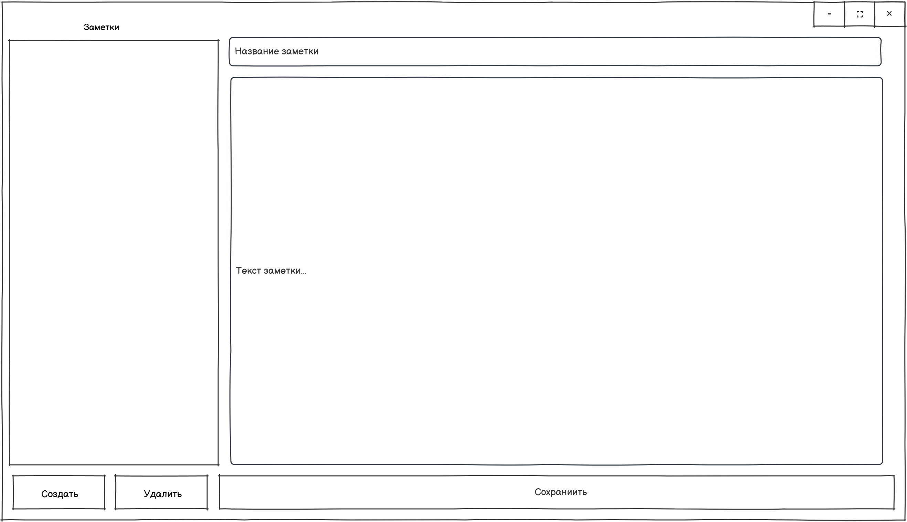

# Программа калькулятор

---------------------------------------------------------------

# Содержание
1. [Введение](#1-введение)
   
   1.1 [Назначение](#11-назначение)
   
   1.2 [Границы проекта](#12-границы-проекта)
   
   1.3 [Аналоги](#13-аналоги)
   
2. [Требования пользователя](#2-требования-пользователя)
   
   2.1 [Программные интерфейсы](#21-программные-интерфейсы)
   
   2.2 [Интерфейс пользователя](#22-интерфейс-пользователя)
   
   2.3 [Характеристики пользователей](#23-характеристики-пользователей)
   
   2.4 [Предположения и зависимости](#24-предположения-и-зависимости)
   
3. [Системные требования](#3-системные-требования)
   
   3.1 [Функциональные требования](#31-функциональные-требования)
   
   3.2 [Нефункциональные требования](#32-нефункциональные-требования)
   
      3.2.1 [Атрибуты качества](#321-атрибуты-качества)

## 1 Введение

### 1.1 Назначение
Калькулятор Pro представляет собой многофункциональное научно-инженерное приложение для выполнения сложных математических вычислений с современным интуитивно понятным интерфейсом. Программа разработана для удовлетворения потребностей широкого круга пользователей — от студентов и преподавателей до инженеров и финансовых специалистов.

### 1.2 Границы проекта
**Возможности продукта:**
- Базовые арифметические операции (сложение, вычитание, умножение, деление)
- Научные функции (тригонометрия, логарифмы, корни, степени)
- Финансовые расчеты (конвертер валют с онлайн-обновлением курсов, кредитный калькулятор с расчетом аннуитетных платежей, ипотечный калькулятор с учетом первоначального взноса, калькулятор накоплений с учетом сложных процентов)
- Режим программиста (конвертация между системами счисления, битовые операции (AND, OR, XOR, NOT), операции сдвига и работы с битами, генератор паролей с настраиваемыми параметрами, конвертер UNIX-времени)
- Система заметок с возможностью создания, редактирования и поиска
- Графическое представление функций

**Программные ограничения продукта:**
- Не поддерживается решение систем уравнений и матричные операции
- Ограниченные возможности для программируемых функций и макросов
- Отсутствие истории вычислений и возможности сохранения сессий
- Нет поддержки комплексных чисел и векторных вычислений
- Ограниченная поддержка экспорта результатов (только копирование)

### 1.3 Аналоги
Калькулятор Pro имеет сходства и отличия по сравнению с популярными аналогами, такими как "Калькулятор Windows", "Numi" и "Wolfram Alpha".

**Сходства с "Калькулятором Windows":**
- Базовый набор математических операций и научных функций
- Научный режим с дополнительными функциями
- Поддержка ввода с клавиатуры
- Интуитивная организация интерфейса по функциональным зонам

**Отличия от "Калькулятора Windows":**
- Улучшенная обработка сложных математических выражений с пошаговым решением
- Интегрированные финансовые расчеты и конвертер валют
- Расширенный режим программиста с генератором паролей
- Встроенная система заметок для ведения записей

**Сходства с "Numi":**
- Поддержка естественного ввода выражений
- Обработка сложных математических формул

**Отличия от "Numi":**
- Чистый и минималистичный интерфейс, ориентированный на содержание
- Обработка сложных математических формул и констант

**Преимущества Калькулятора Pro:**
- Оптимизирован для настольного использования с расширенными возможностями
- Открытый исходный код
- Современный пользовательский интерфейс
- Встроенные специализированные модули (финансы, программист, графики)

**Недостатки:**
- Ограниченный набор функций по сравнению с профессиональными математическими пакетами
- Отсутствие мобильной версии

# 2 Требования пользователя

## 2.1 Программные интерфейсы
Приложение взаимодействует со следующими внешними системами и библиотеками:
- **PyQt5** - для создания графического интерфейса
- **Python math** - для математических вычислений
- **Системные библиотеки** - для обработки звуковых эффектов и анимации
- **Сетевые интерфейсы** - для подключения и обработки api данных

# Пользовательский интерфейс

Система взаимодействует с пользователем через набор экранов.

## 1) Основной экран калькулятора

**Назначение:** быстрые вычисления.  
**Элементы:** дисплей ввода/результатов; цифры 0–9; операции `+ − × ÷`; `%`; смена знака `±`; десятичная точка; `AC` (сброс), `⌫` (удаление), `=`.

## 2) Расширенный (научный) экран

**Назначение:** инженерные и учебные расчёты.  
**Функции:** тригонометрия `sin, cos, tan`; логарифмы `log, ln`; степени и корни `x², x^y, √, ³√, 10^x, e^x`; факториал `n!`; случайное `rand`; модуль `|x|`; константы `π, e`; обратное `1/x`.

## 3) Экран «Программист»

**Назначение:** работа с системами счисления и битовыми операциями.  
**Возможности:** конвертация BIN/OCT/DEC/HEX; логические операции `AND/OR/XOR/NOT` для введённых A и B; выбор базы; битовые сдвиги `<<` и `>>`; конвертер UNIX-времени; генератор паролей с настраиваемым алфавитом.

## 4) Расчёт ипотеки

**Назначение:** аннуитетные платежи по недвижимости.  
**Поля:** стоимость, валюта, первоначальный взнос, годовая ставка, срок (лет).  
**Действие:** «Рассчитать» выводит месячный платёж, переплату и общую сумму.

## 5) Конвертер валют

**Назначение:** перевод сумм между валютами.  
**Поля:** сумма; «из валюты»; «в валюту».  
**Действия:** «Конвертировать» — расчёт по текущему курсу; «Обновить курсы» — подгрузка свежих котировок.

## 6) Расчёт потребительского кредита

**Назначение:** кредит без первоначального взноса.  
**Поля:** сумма, валюта, годовая ставка, срок (в месяцах).  
**Результат:** месячный платёж, переплата; опционально — график.

## 7) Расчёт накоплений (взносами)

**Назначение:** оценка будущего капитала при ежемесячных взносах.  
**Поля:** размер взноса, валюта, годовая ставка, срок (лет).  
**Результат:** будущая стоимость, сумма взносов, доход от процентов.

## 8) Построение графиков функций

**Назначение:** визуализация математических функций.  
**Элементы:** поле `f(x)`, кнопка «Построить график», оси с сеткой и курсором; поддержка стандартных функций (`sin`, `cos`, `exp`, `log`, полиномиальные и т. п.).

## 9) Заметки

**Назначение:** хранение расчётных набросков и комментариев.  
**Элементы:** список заметок; поля «Название» и «Текст заметки»; кнопки «Создать», «Удалить», «Сохранить».

## 2.3 Характеристики пользователей
**Студенты и школьники:**
- Учащиеся математических и технических специальностей
- Уровень образования - от средней школы до университета
- Техническая грамотность - средняя
- Цели использования: решение математических задач, выполнение домашних заданий, подготовка к экзаменам.

**Инженеры и научные работники:**
- Профессионалы, выполняющие технические расчеты
- Уровень образования - высшее образование
- Техническая грамотность - высокая
- Цели использования: проведение сложных инженерных и научных расчетов, работа с графиками, программистские функции.

**Офисные работники:**
- Пользователи, выполняющие повседневные расчеты
- Техническая грамотность - базовая
- Цели использования: простые арифметические операции, конвертация валют, расчет процентов.

**Финансовые специалисты:**
- Профессионалы, работающие в банковской сфере, бухгалтерии.
- Уровень образования: высшее образование.
- Техническая грамотность: средняя или высокая.
- Цели использования: расчет кредитов, ипотеки, накоплений, конвертация валют.

**Программисты и IT-специалисты:**
- Профессионалы, работающие в области информационных технологий.
- Уровень образования: высшее образование.
- Техническая грамотность: высокая.
- Цели использования: работа с различными системами счисления, битовые операции, генерация паролей.

## 2.4 Предположения и зависимости
- Пользователи знакомы с основами работы математических калькуляторов (базовые арифметические операции, использование скобок и т.д.).
- Наличие установленного Python 3.7+
- Доступность библиотек PyQt5 и системных ресурсов для отображения графики
- Наличие подключения к интернету для получения актуальных курсов валют (для финансового модуля).
- Пользователи имеют базовые навыки работы с графическим интерфейсом (использование мыши, клавиатуры).
- Для использования расширенных функций (построение графиков) требуются дополнительные библиотеки (matplotlib, numpy), которые могут быть установлены пользователем при необходимости.

# 3 Системные требования

## 3.1 Функциональные требования
1. **Пользователь должен иметь возможность выполнять базовые арифметические операции**
   - Сложение, вычитание, умножение, деление
   - Работа с десятичными числами

2. **Пользователь должен иметь доступ к научным функциям**
   - Тригонометрические вычисления (sin, cos, tan)
   - Логарифмы (log, ln)
   - Квадратные корни и возведение в степень

3. **Система должна поддерживать сложные математические выражения**
   - Работа со скобками
   - Комбинирование различных операций
   - Приоритет операций

4. **Пользователь должен иметь возможность ввода с клавиатуры**
   - Поддержка цифровых клавиш
   - Поддержка операторов и функций
   - Управление с помощью клавиш Backspace, Enter, Escape

5. **Система должна обеспечивать безопасные вычисления**
   - Обработка деления на ноль
   - Проверка корректности выражений
   - Защита от математических ошибок

6. **Пользователь должен иметь визуальную обратную связь**
   - Анимация нажатия кнопок
   - Визуальное выделение различных типов кнопок

## 3.2 Нефункциональные требования

### 3.2.1 Атрибуты качества
**Надежность:**
- Приложение должно корректно обрабатывать все допустимые математические выражения
- Обеспечение стабильной работы без неожиданных завершений
- Надежность измеряется количеством обработанных исключений и стабильностью работы при длительном использовании

**Безопасность:**
- Защита от выполнения произвольного кода через математические выражения
- Безопасный eval с ограниченным контекстом
- Безопасность обеспечивается через white-list разрешенных функций и символов

**Удобство использования:**
- Интуитивно понятный интерфейс с группировкой функций по назначению
- Визуальное разделение базовых и расширенных функций
- Поддержка как мыши, так и клавиатурного ввода
- Удобство использования измеряется через время освоения основных функций и количество ошибок ввода

**Производительность:**
- Мгновенный отклик на пользовательский ввод
- Плавная анимация интерфейса
- Минимальное потребление системных ресурсов
- Производительность измеряется временем отклика на операции и использованием памяти

**Совместимость:**
- Кроссплатформенная работа на Windows, Linux, macOS
- Поддержка различных разрешений экрана
- Адаптация под разные системные темы

---
>>>>>>> origin/main
