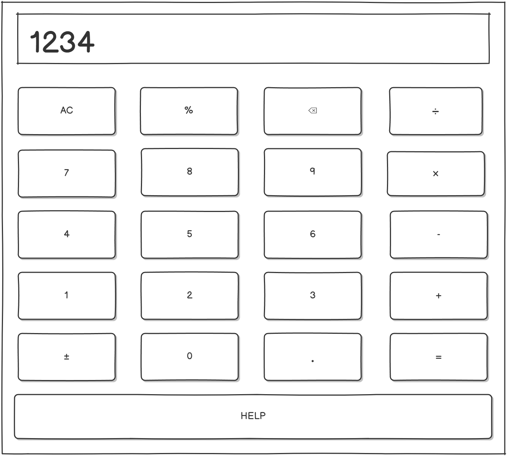

# ТРЕБОВАНИЯ К ПРОЕКТУ

---------------------------------------------------------------

# Содержание
1. [Введение](#введение)
   
   1.1 [Назначение](#назначение)
   
   1.2 [Границы проекта](#границы-проекта)
   
   1.3 [Аналоги](#аналоги)
   
2. [Требования пользователя](#требования-пользователя)
   
   2.1 [Программные интерфейсы](#программные-интерфейсы)
   
   2.2 [Интерфейс пользователя](#интерфейс-пользователя)
   
   2.3 [Характеристики пользователей](#характеристики-пользователей)
   
   2.4 [Предположения и зависимости](#предположения-и-зависимости)
   
3. [Системные требования](#системные-требования)
   
   3.1 [Функциональные требования](#функциональные-требования)
   
   3.2 [Нефункциональные требования](#нефункциональные-требования)
   
      3.2.1 [Атрибуты качества](#атрибуты-качества)

## 1 Введение

## 1.1 Назначение
Калькулятор Pro - это современное научное приложение для вычислений с интуитивно понятным интерфейсом. Программа предоставляет расширенные математические функции, поддержку сложных выражений и анимационные эффекты для улучшения пользовательского опыта.

## 1.2 Границы проекта
**Возможности продукта:**
- Базовые арифметические операции (сложение, вычитание, умножение, деление)
- Научные функции (тригонометрия, логарифмы, корни, степени)
- Поддержка констант (π, e)
- Работа со скобками и сложными выражениями
- Анимационные эффекты кнопок
- Поддержка клавиатурного ввода
- Двухэкранный интерфейс (базовый и расширенный)

**Программные ограничения продукта:**
- Графическое представление функций
- Система уравнений
- Программируемые функции
- История вычислений

## 1.3 Аналоги
Калькулятор Pro имеет сходства и отличия по сравнению с популярными аналогами, такими как "Калькулятор Windows" и "Numi".

**Сходства с "Калькулятором Windows":**
- Базовый набор математических операций
- Научный режим с дополнительными функциями
- Поддержка ввода с клавиатуры

**Отличия от "Калькулятора Windows":**
- Современный анимированный интерфейс
- Улучшенная обработка математических выражений
- Более интуитивная организация функций

**Сходства с "Numi":**
- Поддержка естественного ввода выражений
- Обработка сложных математических формул

**Отличия от "Numi":**
- Локальная установка без зависимости от облачных сервисов
- Оптимизирован для настольного использования

**Преимущества Калькулятора Pro:**
- Бесплатное использование
- Открытый исходный код
- Современный пользовательский интерфейс
- Кроссплатформенность

**Недостатки:**
- Ограниченный набор функций по сравнению с профессиональными математическими пакетами
- Отсутствие мобильной версии

# 2 Требования пользователя

## 2.1 Программные интерфейсы
Приложение взаимодействует со следующими внешними системами и библиотеками:
- **PyQt5** - для создания графического интерфейса
- **Python math** - для математических вычислений
- **Системные библиотеки** - для обработки звуковых эффектов и анимации

## 2.2 Интерфейс пользователя
Система взаимодействует с пользователем через графический интерфейс, который включает:

#### Основной экран: 

- Дисплей для ввода и отображения результатов
- Базовые арифметические операции
- Кнопки управления (очистка, удаление символа)

#### Расширенный экран:

- Тригонометрические функции (sin, cos, tan)
- Логарифмические функции (log, ln)
- Операции со степенями и корнями
- Математические константы

## 2.3 Характеристики пользователей
**Студенты и школьники:**
- Учащиеся математических и технических специальностей
- Уровень образования - от средней школы до университета
- Техническая грамотность - средняя

**Инженеры и научные работники:**
- Профессионалы, выполняющие технические расчеты
- Уровень образования - высшее образование
- Техническая грамотность - высокая

**Офисные работники:**
- Пользователи, выполняющие повседневные расчеты
- Техническая грамотность - базовая

## 2.4 Предположения и зависимости
- Пользователи знакомы с основами работы математических калькуляторов
- Наличие установленного Python 3.7+
- Доступность библиотек PyQt5 и системных ресурсов для отображения графики

# 3 Системные требования

## 3.1 Функциональные требования
1. **Пользователь должен иметь возможность выполнять базовые арифметические операции**
   - Сложение, вычитание, умножение, деление
   - Работа с десятичными числами

2. **Пользователь должен иметь доступ к научным функциям**
   - Тригонометрические вычисления (sin, cos, tan)
   - Логарифмы (log, ln)
   - Квадратные корни и возведение в степень

3. **Система должна поддерживать сложные математические выражения**
   - Работа со скобками
   - Комбинирование различных операций
   - Приоритет операций

4. **Пользователь должен иметь возможность ввода с клавиатуры**
   - Поддержка цифровых клавиш
   - Поддержка операторов и функций
   - Управление с помощью клавиш Backspace, Enter, Escape

5. **Система должна обеспечивать безопасные вычисления**
   - Обработка деления на ноль
   - Проверка корректности выражений
   - Защита от математических ошибок

6. **Пользователь должен иметь визуальную обратную связь**
   - Анимация нажатия кнопок
   - Визуальное выделение различных типов кнопок

## 3.2 Нефункциональные требования

### 3.2.1 Атрибуты качества
**Надежность:**
- Приложение должно корректно обрабатывать все допустимые математические выражения
- Обеспечение стабильной работы без неожиданных завершений
- Надежность измеряется количеством обработанных исключений и стабильностью работы при длительном использовании

**Безопасность:**
- Защита от выполнения произвольного кода через математические выражения
- Безопасный eval с ограниченным контекстом
- Безопасность обеспечивается через white-list разрешенных функций и символов

**Удобство использования:**
- Интуитивно понятный интерфейс с группировкой функций по назначению
- Визуальное разделение базовых и расширенных функций
- Поддержка как мыши, так и клавиатурного ввода
- Удобство использования измеряется через время освоения основных функций и количество ошибок ввода

**Производительность:**
- Мгновенный отклик на пользовательский ввод
- Плавная анимация интерфейса
- Минимальное потребление системных ресурсов
- Производительность измеряется временем отклика на операции и использованием памяти

**Совместимость:**
- Кроссплатформенная работа на Windows, Linux, macOS
- Поддержка различных разрешений экрана
- Адаптация под разные системные темы

---
